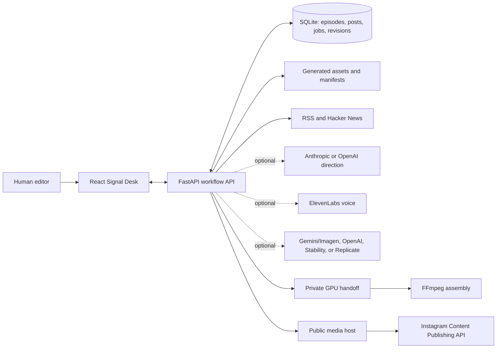
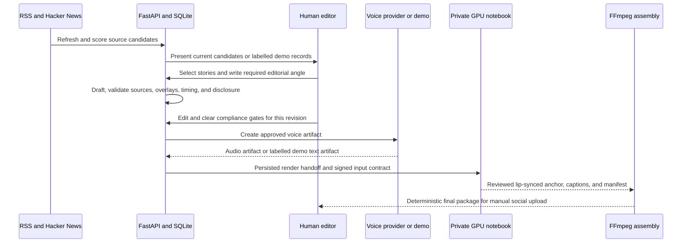
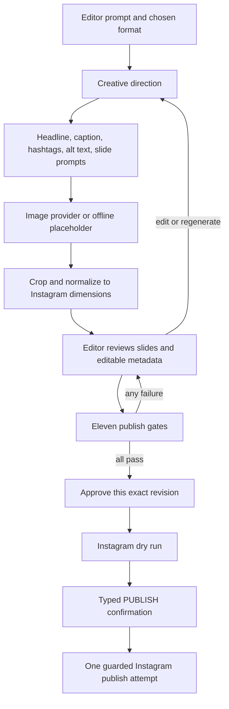
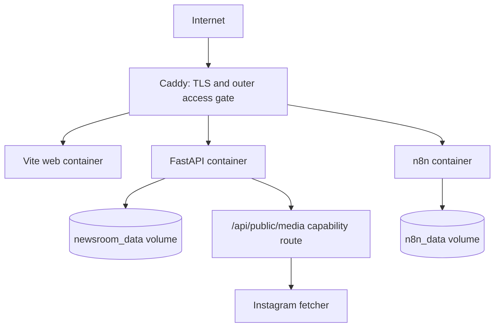

# Giani AI News Anchor

Giani is a human-in-the-loop newsroom for producing a daily AI news briefing
and a weekly deep dive with the fictional anchor **Mira**. It combines a
React editorial desk, a FastAPI workflow API, live-source research,
compliance gates, optional AI voice and drafting providers, a private GPU
lip-sync handoff, and deterministic FFmpeg assembly.

It also contains **Post Studio**: a second, self-contained pipeline that turns
one plain prompt into a finished Instagram post — image or carousel, caption,
hashtags, alt text — holds it for human review, and publishes it directly to
Instagram on one confirmed click.

The implementation follows the specifications in this repository:

- [AI-News-Anchor-Build-Plan.md](AI-News-Anchor-Build-Plan.md)
- [AI-News-Anchor-FREE-Stack.md](AI-News-Anchor-FREE-Stack.md)
- [Instagram-Post-Pipeline.md](Instagram-Post-Pipeline.md)

## What is included

- **Signal Desk:** responsive React, TypeScript, and Vite application with
  Overview, Research, Studio, Posts, Library, Runs, and Settings routes.
- **Editorial API:** FastAPI and SQLite service for research, story selection,
  structured drafts, approval, compliance, voice artifacts, render jobs, and
  publish packages.
- **Safe demo mode:** visibly fictional seed stories, deterministic offline
  drafting, and text-only demo voice artifacts. The system never presents a
  placeholder as current news or a fake MP3/video as real output.
- **Research automation:** importable n8n workflow scheduled for 06:30
  Asia/Kolkata, with manual review before story selection.
- **Free render path:** private Kaggle notebook, R2 signed-URL contract,
  faster-whisper captions, and a MuseTalk fallback.
- **Final assembly:** matching PowerShell and Bash entry points backed by one
  validated Python/FFmpeg engine.
- **Canonical identity:** original vertical and horizontal Mira anchor assets,
  plus identity and voice-profile metadata.
- **Post Studio:** prompt to creative direction to generated slides to human
  review to a confirmed Instagram publish, with five interchangeable image
  providers and eleven publish gates.

## Architecture

```text
RSS + Hacker News ──> FastAPI + SQLite ──> React Signal Desk
                           │                    │
                           │ human review      │ approve gates
                           v                    v
                    Anthropic (optional)   ElevenLabs (optional)
                           │                    │
                           └──────────┬─────────┘
                                      v
                           private Kaggle lip sync
                                      │
                                      v
                        FFmpeg captions + B-roll + cards
                                      │
                                      v
                         human review and manual upload
```

The video pipeline never uploads to a social platform. A human editor supplies
the angle, reviews every source, clears every compliance gate, and performs the
final publication.

Post Studio is the one path that can publish, and only under an explicit human
confirmation:

```text
prompt ──> creative direction ──> image generation ──> Instagram-exact JPEG
             (Claude/offline)      (Gemini · Imagen · OpenAI ·
                                    Stability · Replicate · offline)
                                              │
                                              v
                                    human review in /posts
                                    eleven automatic gates
                                              │
                                              v
                              approve  ──>  type PUBLISH  ──>  Instagram
```

Publishing is disabled by default, refuses placeholder images outright, refuses
any revision the reviewer did not see, and cannot post the same revision twice.
Full setup is in [Instagram-Post-Pipeline.md](Instagram-Post-Pipeline.md).

## End-to-end architecture flows

### 1. Runtime topology and ownership



The React application is the editor's control surface; it never contains
provider credentials. FastAPI owns all workflow state, provider calls, file
creation, and publishing decisions. SQLite stores the durable workflow state;
generated voice, slide, and manifest files live in the configured asset
directory. The browser talks only to the API, and all external-provider
credentials stay server-side.

Human control is a deliberate boundary, not a UI suggestion:

- Automation may collect candidates, prepare drafts, create media prompts, and
  surface missing checks.
- The editor must choose stories, supply the editorial angle, review content,
  approve the exact revision, and explicitly initiate any publish action.
- The news-video path produces a reviewed package for manual upload. Only Post
  Studio has an Instagram client, and it is disabled by default.

### 2. Daily briefing and deep-dive video flow



`POST /api/research/refresh` uses public RSS and Hacker News sources. If it
cannot retrieve suitable recent material, it returns visibly labelled demo
records rather than inventing news. The optional n8n workflow only schedules
the refresh and formats a neutral digest; it never selects stories or writes an
editorial angle.

The editorial API permits exactly three stories for a daily briefing or one
story for a deep dive. Content edits invalidate the relevant approval state,
so an editor cannot publish a package based on a revision they have not
reviewed. A render job records an honest handoff manifest; it is not presented
as a completed video before the private GPU and FFmpeg stages actually finish.

The GPU notebook is intentionally separate from the public application. It
uses short-lived signed URLs for the reviewed anchor and voice inputs and
returns the lip-sync output, captions, and manifest. LatentSync 1.6 requires a
single GPU with at least 18 GB VRAM; on a 16 GB T4, use the documented
MuseTalk fallback instead. The shared PowerShell/Bash assembly wrappers invoke
one Python/FFmpeg engine, which validates timing, captions, B-roll cues, and
the reviewed voice before atomically writing the final package.

### 3. Post Studio generation and review flow



`posts.py` creates and validates the creative direction; `imaging.py` calls the
selected provider and produces a normalized JPEG; `post_pipeline.py` persists
the assets and coordinates the next stage. Offline images are visibly stamped
`DEMO PLACEHOLDER` and can never pass the publishing gate.

Every editable change increments the post revision and revokes approval. The
approval and publish checks require, among other conditions, current
non-placeholder media, the reviewed revision, caption and hashtag rules,
alt text, disclosure, and all eleven editor-cleared checks. A database-backed
publish record prevents a race or double click from publishing the same
revision twice.

### 4. Instagram publishing and media-delivery flow

```mermaid
sequenceDiagram
    participant E as Human editor
    participant API as FastAPI Post Studio
    participant Store as Local public route or S3/R2
    participant IG as Instagram API

    E->>API: Request dry run for approved revision
    API->>API: Check configuration, quotas, gates, and revision
    API-->>E: Readiness report; no publish
    E->>API: Confirm publish for expected revision
    API->>Store: Build public HTTPS URLs for each slide
    IG->>Store: Fetch slide bytes from public URL
    API->>IG: Create container(s), poll status, publish container
    IG-->>API: Media ID and permalink
    API-->>E: Persisted publish result
```

Instagram fetches media from the public URL itself; it cannot fetch from
`localhost`. In local mode, start a public HTTPS tunnel and set
`NEWSROOM_PUBLIC_BASE_URL`. In production, use the deployed HTTPS domain or an
S3-compatible host such as R2. `media_host.py` creates local capability URLs or
performs S3-compatible uploads, while `instagram.py` performs the Content
Publishing API calls and optional token diagnostics.

In Compose, Caddy protects the desk and automation sites with Basic Auth, but
allows only `/api/public/media/*` through without that challenge because
Instagram's fetcher cannot provide credentials. Each media URL includes a
rotating per-asset token; it is replaced when an asset is regenerated. The
application remains fail-closed until an account ID, access token, public media
route, non-demo asset, and `INSTAGRAM_PUBLISH_ENABLED=true` are all present.

### 5. Deployment and operational flow



The production Compose stack exposes ports only through Caddy. The web app,
API, and n8n stay on the internal Docker network; persistent data is stored in
named volumes, and repository anchor assets are mounted read-only. n8n's
06:30 Asia/Kolkata workflow calls the research refresh endpoint, is imported
inactive, and should be manually inspected before activation. Back up the
newsroom data volume, n8n data volume, and the untracked production environment
file; test a restore before relying on the deployment.

### 6. Configuration and safety checkpoints

| Capability | Required configuration | Safe behavior when absent |
|---|---|---|
| Research | None for public RSS/Hacker News | Labelled demo workspace when live sources are unavailable |
| Direction and drafting | Optional Anthropic or OpenAI key | Deterministic offline direction |
| Voice | `ELEVENLABS_API_KEY` and `ELEVENLABS_VOICE_ID` | Text-only demo artifact, never described as audio |
| Image generation | One supported image-provider key | Stamped placeholder that cannot publish |
| Public media | HTTPS base URL or S3-compatible configuration | Instagram dry run remains blocked |
| Instagram | Account ID, token, matching login mode, and enabled switch | No publish attempt; status reports the missing item |

Use `GET /api/capabilities` to inspect provider resolution and
`GET /api/instagram/status` to validate the Meta account, token, quota, and
media-host readiness without publishing. Keep credentials in the API process
environment or the Git-ignored `infra/.env` used by Compose; never use
`VITE_*`, source files, notebooks, workflow exports, or Git for secrets.

## Quick start

Requirements:

- Python 3.10 or newer
- [uv](https://docs.astral.sh/uv/) for the backend
- Node.js and npm for the web app

Start the API in one PowerShell window:

```powershell
cd E:\giani_reporter\apps\api
$env:UV_PROJECT_ENVIRONMENT = 'E:\cache\venvs\giani_reporter'
$env:UV_CACHE_DIR = 'E:\cache\uv'
uv sync --extra dev
uv run uvicorn newsroom_api.main:app --reload --host 127.0.0.1 --port 8000
```

Start the desk in a second PowerShell window:

```powershell
cd E:\giani_reporter\apps\web
$env:npm_config_cache = 'E:\cache\npm'
npm install
$env:VITE_API_URL = 'http://127.0.0.1:8000/api'
npm run dev -- --host 127.0.0.1 --port 5173
```

Open `http://127.0.0.1:5173`. API documentation is available at
`http://127.0.0.1:8000/docs`.

The desk can also run without the API. In that case it opens a clearly marked
browser-local demo workspace.

## Editorial workflow

1. Refresh recent RSS and Hacker News candidates.
2. Select exactly three stories for a daily episode, or one for a deep dive.
3. Write a mandatory human editorial angle.
4. Generate an offline or optional Anthropic draft.
5. Edit the structured script, overlays, and B-roll cues.
6. Approve only after the source, language, timing, format, and disclosure
   checks pass.
7. Generate the voice artifact.
8. Create and inspect the render handoff.
9. Run private lip sync and local FFmpeg assembly with real reviewed media.
10. Review the publish package and upload manually.

## Post Studio workflow

1. Write one prompt and pick a format (square, portrait, landscape, carousel,
   story, or reel).
2. The pipeline writes the headline, one image prompt per slide, the caption,
   the hashtags, and the alt text, then generates and crops each slide.
3. Review every slide. Edit any text, regenerate the imagery, or upload your
   own photo or video instead.
4. Clear the eleven checks and approve the exact revision you reviewed.
5. Run the Instagram dry run, then type `PUBLISH` to publish.

Editing anything revokes the approval. A slide generated for an older revision
stops counting as current. A placeholder image can never be published.

Daily scripts are constrained to 210–225 words. Deep dives are constrained to
900–1100 words. Approval also enforces source links, spoken-number and acronym
rules, short sentences, neutral anchor framing, five hashtags, four timed
overlays, and an 8–12 second B-roll cadence.

## Optional providers

Provider secrets belong only in the API environment:

```powershell
# Newsroom
$env:ANTHROPIC_API_KEY = '...'
$env:ELEVENLABS_API_KEY = '...'
$env:ELEVENLABS_VOICE_ID = '...'

# Post Studio image generation. Set one; auto picks the first configured.
$env:GOOGLE_API_KEY = '...'       # Gemini image and Imagen
$env:OPENAI_API_KEY = '...'       # gpt-image-1
$env:STABILITY_API_KEY = '...'    # Stable Image Core
$env:REPLICATE_API_TOKEN = '...'  # FLUX and others

# Post Studio publishing. Instagram fetches media from its own servers, so the
# API needs a public HTTPS address (Cloudflare Tunnel, ngrok, or a deployment).
$env:NEWSROOM_PUBLIC_BASE_URL = 'https://your-tunnel.example.com'

# Meta / Instagram Content Publishing API
$env:META_APP_ID = '...'              # from developers.facebook.com
$env:META_APP_SECRET = '...'          # enables appsecret_proof + token exchange
$env:INSTAGRAM_USER_ID = '...'        # IG Business account id
$env:META_ACCESS_TOKEN = '...'        # long-lived token (INSTAGRAM_ACCESS_TOKEN also read)
$env:INSTAGRAM_PUBLISH_ENABLED = 'true'
```

Do not place secrets in `VITE_*` variables, source files, notebooks, workflow
JSON, or Git. Without these values, the core research, drafting, review,
compliance, and packaging workflow remains usable in deterministic demo mode,
and Post Studio still runs end to end using visibly stamped placeholder images
that the publish gate always refuses.

`GET /api/capabilities` reports exactly which providers resolved and what is
still missing. `GET /api/instagram/status` checks the token, account, and quota
without publishing anything.

## Test and build

Backend:

```powershell
cd E:\giani_reporter\apps\api
$env:UV_PROJECT_ENVIRONMENT = 'E:\cache\venvs\giani_reporter'
$env:UV_CACHE_DIR = 'E:\cache\uv'
uv run pytest
```

Frontend:

```powershell
cd E:\giani_reporter\apps\web
$env:npm_config_cache = 'E:\cache\npm'
npm test
npm run build
```

Infrastructure and production assembly are documented in
[infra/README.md](infra/README.md) and [scripts/README.md](scripts/README.md).

## GPU note

ByteDance documents an 18 GB minimum for LatentSync 1.6. A 16 GB Kaggle T4
does not meet that requirement, and two T4 cards do not combine their memory
for the official inference process. The included notebook therefore stops
before attempting LatentSync on a T4 and directs the operator to the lighter
MuseTalk path.

## Repository map

```text
apps/api/       FastAPI, SQLite, provider adapters, and tests
apps/web/       React Signal Desk and component/API tests
assets/anchor/  Canonical Mira images and identity profile
assets/broll/   Fifteen reviewed B-roll definitions, without fake clips
infra/          Compose, Caddy, n8n, and private Kaggle worker
scripts/        Cross-platform FFmpeg assembly
```

Post Studio lives in `apps/api/src/newsroom_api/`:

```text
posts.py          Creative direction, caption rules, the eleven checks
imaging.py        Image providers and Instagram-exact normalization
media_host.py     Public URLs: local serving or S3-compatible upload
instagram.py      Content Publishing API client
post_pipeline.py  Stage orchestration and the publish sequence
```

Generated databases, credentials, audio, videos, render manifests, and local
environment files are excluded from version control.
