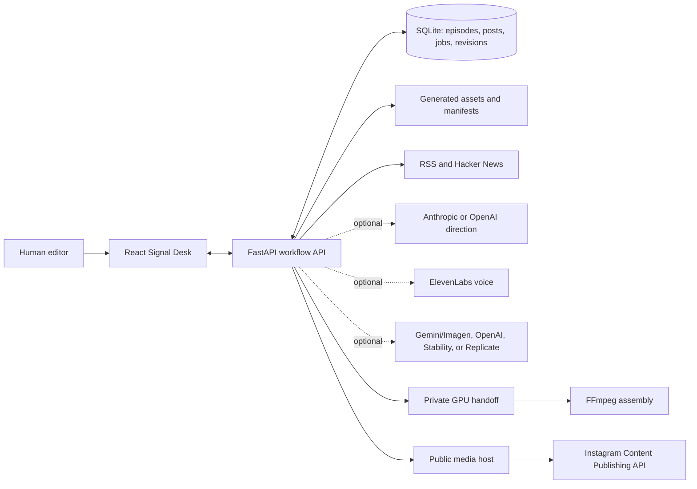
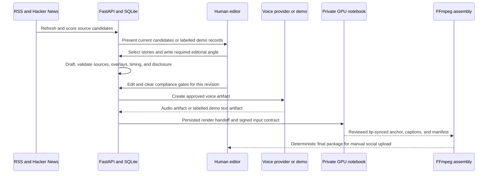
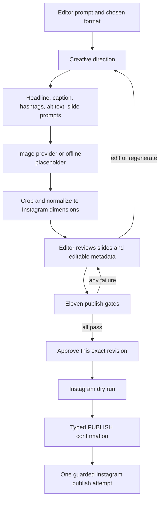
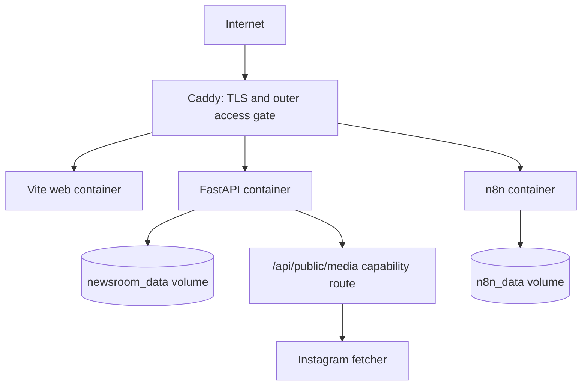

# Giani AI News Anchor

**Documentation updated:** 3 October 2026 · **Verified against the code:** 3 October 2026 · **Timezone:** Asia/Kolkata.

> **Phase 0 of the October upgrade plan is implemented and tested:** publish attempts with an unclear outcome are now held and reconciled instead of retried, a publish is bound to the account shown in the dry run, a media-only gateway replaces tunnelling the whole API, and the dry run fetches every slide through the public address before reporting ready. On 3 October 2026, 113 backend tests and 12 frontend tests passed, and the TypeScript and production builds were clean. Phases 1–5 remain proposals. No real Instagram post has been published yet.
>
> Full implementation detail: [advanced plan](docs/ADVANCED_IMPLEMENTATION_PLAN_2026-10-03.md). Evidence and unresolved checks: [source audit](docs/VERIFIED_SOURCES_2026-10-03.md). The [unchanged original README](docs/BASELINE_README_2026-10-02.md) preserves the setup history and original wording.

Giani is a human-in-the-loop newsroom for producing a daily AI news briefing
and a weekly deep dive with the fictional anchor **Mira**. It combines a
React editorial desk, a FastAPI workflow API, live-source research,
compliance gates, optional AI voice and drafting providers, a private GPU
lip-sync handoff, and deterministic FFmpeg assembly.

It also contains **Post Studio**: a second, self-contained pipeline that turns
one plain prompt into a finished Instagram post — image or carousel, caption,
hashtags, alt text — holds it for human review, and publishes it directly to
Instagram on one confirmed click.

The implementation follows the specifications in this repository:

- [AI-News-Anchor-Build-Plan.md](AI-News-Anchor-Build-Plan.md)
- [AI-News-Anchor-FREE-Stack.md](AI-News-Anchor-FREE-Stack.md)
- [Instagram-Post-Pipeline.md](Instagram-Post-Pipeline.md)

## What is included

- **Signal Desk:** responsive React, TypeScript, and Vite application with
  Overview, Research, Studio, Posts, Library, Runs, and Settings routes.
- **Editorial API:** FastAPI and SQLite service for research, story selection,
  structured drafts, approval, compliance, voice artifacts, render jobs, and
  publish packages.
- **Safe demo mode:** visibly fictional seed stories, deterministic offline
  drafting, and text-only demo voice artifacts. The system never presents a
  placeholder as current news or a fake MP3/video as real output.
- **Research automation:** importable n8n workflow scheduled for 06:30
  Asia/Kolkata, with manual review before story selection.
- **Free render path:** private Kaggle notebook, R2 signed-URL contract,
  faster-whisper captions, and a MuseTalk fallback.
- **Final assembly:** matching PowerShell and Bash entry points backed by one
  validated Python/FFmpeg engine.
- **Canonical identity:** original vertical and horizontal Mira anchor assets,
  plus identity and voice-profile metadata.
- **Post Studio:** prompt to creative direction to generated slides to human
  review to a confirmed Instagram publish, with five interchangeable image
  providers and eleven publish gates.

## Current status (3 October 2026)

| Area | State |
|---|---|
| Code | Phase 0 implemented. 113 backend tests (77 original, 36 new) and 12 frontend tests pass; the TypeScript and production builds are clean. |
| Instagram account | `@gianireporter.ai` (Creator account) connected through Instagram Login. A read-only status check on 3 October returned 0 of 100 for the account's 24-hour publishing quota. That is a snapshot, not a permanent limit. |
| Graph API version | Default is now `v25.0`. Meta lists `v21.0` as expiring on 21 January 2027 and `v25.0` on 29 July 2028. Read calls were checked on both. |
| Publishing switch | Off (`INSTAGRAM_PUBLISH_ENABLED=false`) until the first reviewed test post. |
| Public media URL | Needs one live tunnel address pointing at the media gateway. The local `NEWSROOM_PUBLIC_BASE_URL` value is malformed, and the status check now reports it as not ready. |
| Image generation | No provider key yet. Upload a photo you hold the rights to for real posts. |
| Production deployment | Not started. Compose needs the Caddy and n8n secrets. |

The setup history, next steps and deadlines are in
[Instagram publishing: setup log and next steps](#instagram-publishing-setup-log-and-next-steps).

## October 2026 upgrade plan

The recommended direction is an **evidence-first newsroom with reusable, claim-linked media**, not a fully autonomous social-posting agent. Keep Signal Desk, Mira, Post Studio, the human editorial angle, all eleven existing publishing checks, and the distinction between manual news-video upload and confirmed Instagram publishing.

### What to implement first

| Priority | Addition | Concrete outcome | Implementation status |
|---|---|---|---|
| P0 | Safe first publish and deployment preflight | A real reviewed image reaches the intended account; private routes remain private | **Implemented 3 October 2026:** media-only gateway, delivery preflight in the dry run and publish, destination-bound confirmation. The first real publish is still to be done by the operator |
| P0 | Persisted publish attempts and unknown-outcome reconciliation | A timeout cannot trigger an automatic second post | **Implemented 3 October 2026:** `submitted` and `unknown_outcome` states, restart recovery, reconcile endpoint and desk panel |
| P1 | Claim Ledger and Evidence Desk | Every factual sentence points to reviewed evidence, including numbers, dates and qualifications | Proposed |
| P1 | Release/event memory | Separate paper publication, announcement, API access, weights release, and third-party quantization | Proposed |
| P1 | Source-change and correction tracking | Identify every script, slide, caption and audio segment affected by a changed claim | Proposed |
| P2 | Template-first Post Studio | Render exact headlines and charts from validated data without requiring a generative-image key | Proposed; not the current offline placeholder path |
| P2 | Shared StorySpec and incremental rendering | Reuse one approved evidence packet across separately reviewed formats; rebuild only affected artifacts | Proposed |
| P3 | Voice adapters, pronunciation QA and language editions | Compare new speech models against the existing voice path without changing Mira silently | Proposed |
| P3 | Media QA and provenance | Check real output, maintain creation/edit history and show synthetic-media disclosure | Proposed |
| P4 | Durable workers, observability and evaluation | Recover interrupted jobs, measure cost per accepted output, and test factual/approval failures | Proposed |

The detailed module contracts, test cases and six implementation phases are in [the advanced implementation plan](docs/ADVANCED_IMPLEMENTATION_PLAN_2026-10-03.md). The example policy, StorySpec and evaluation files the plan mentions were not included with it and are not in this repository.

### Proposed architecture


```mermaid
flowchart LR
    Sources[Official announcements, papers, model cards, RSS and HN] --> Intake[Bounded source intake]
    Intake --> Snapshots[Versioned source snapshots]
    Snapshots --> Ledger[Claims, evidence and release events]
    Ledger --> Desk[Signal Desk: human selection and angle]
    Desk --> Spec[Versioned StorySpec]
    Spec --> Drafts[Drafting and checking adapters]
    Drafts --> Review[Human script review]
    Review --> Compiler[Template and media compiler]
    Compiler --> Assets[Immutable rendition assets]
    Assets --> QA[Media QA and final human review]
    QA --> Video[News-video package: manual upload]
    QA --> Posts[Post Studio: dry run and typed confirmation]
    Posts --> Publisher[Guarded Instagram publisher]
    Ledger --> Corrections[Correction impact tracking]
    Corrections --> Desk
```

This is a target design. Apart from the guarded Instagram publisher hardened in Phase 0, these nodes do not exist in the code yet. A graph here describes data relationships; it does not require a graph database.

### 1. Claim Ledger, not just a bibliography

A proposed claim record binds a statement to source snapshot IDs, exact supporting spans, the source's role, its event date, and a reviewer decision. The system should distinguish `supported`, `partially_supported`, `contradicted`, and `unverified`; these are review states, not calibrated truth probabilities.

For example, an official launch announcement supports **“the company announced model A”**. It does not independently prove **“model A is the best model”**. A benchmark claim needs its benchmark version, metric, evaluation conditions and attribution. Two sites reproducing the same release are not two independent confirmations.

Build date, number, entity, unit and qualifier checks around the existing source gate. An LLM may propose evidence mappings; it cannot approve them. A missing source blocks a factual news assertion or routes it to explicit review, rather than being repaired with model memory.

### 2. News memory and correction propagation

Store `published_at`, `event_at`, `first_seen_at`, `fetched_at`, `timezone`, and `date_precision` separately. Unknown dates stay unknown. Record the distinction between announced, preview, generally available, weights available, and unavailable-to-this-account.

Track dependencies as:

```text
source snapshot → claim revision → story revision → script/slide/caption → asset → publication
```

A source change creates a review task. It must not silently rewrite an already reviewed story. A material claim correction invalidates affected approvals and prepares replacement artifacts. Previously published media requires an editor-approved correction action; do not assume a social API can replace a published video's bytes.

### 3. Template-first Post Studio and a shared StorySpec

Use a structured content specification for headlines, bullets, approved numeric data, references, branding, disclosures, safe areas and language. Render final typography and factual charts with controlled HTML/SVG templates or another deterministic layout engine. Generated imagery is optional background artwork, never the authority for a benchmark chart or an event photograph.

The current offline mode still creates unpublishable placeholders. The **proposed** template renderer is a separate real-media provider and must pass the same review and publishing gates as an uploaded photo.

A reviewed evidence packet may prepare several outputs, but each caption, translation, crop and final rendered file needs its own approval. Keep the current daily three-story and deep-dive one-story policies. Do not relabel the 210–225-word daily profile as a 30-second video; calculate timing from the actual reviewed audio.

### 4. Current model candidates to evaluate

These are upstream options verified in documentation available on **3 October 2026**. They are not claimed to be installed, free to run, accessible through this account, or compatible with the current adapters without changes.

| Task | Candidate | Date/access evidence | Suggested Giani use |
|---|---|---|---|
| Complex drafting/checking | `gpt-6.1-sol` | API release recorded 29 September 2026 [E01] | Optional bounded challenger for difficult evidence packets; no publish tools |
| Economical extraction/routing | `gemini-3.5-flash-lite` | GA recorded 21 July 2026 [E03] | Candidate for source classification and schema extraction; benchmark first |
| Precise image edits | `gpt-image-2.5-sunburst` | API release recorded 8 September 2026 [E01], [E02] | Reference-guided illustration edits with reapproval |
| Image generation | `gpt-image-2.5-flare` | API release recorded 8 September 2026 [E01], [E02] | Optional visual backgrounds; measure cost and acceptance rate |
| Google image adapters | `gemini-3.1-flash-image`, `gemini-3.1-flash-lite-image` | GA entries dated 28 May and 30 June 2026 [E03], [E04] | Compare reference fidelity versus simpler background generation |
| Hosted speech | `gemini-3.8-flash-tts`, `gemini-3.8-flash-lite-tts` | GA recorded 22 September 2026 [E03] | Voice-quality/cost challengers; explicitly review supported voices and language behavior |
| Local speech generation/editing | AuK / AuK-Flash | Code/weights released 9 September; additional deployment updates followed in September [E05] | Test narration repair and generation in a separate worker |
| Local English voice design | Qwen3-TTS 0.6B/1.7B families | Release recorded 22 January 2026 [E06] | Evaluate an original Mira voice and long-script consistency |
| Hindi/Punjabi editions | IndicF5 | Model card explicitly includes Hindi and Punjabi [E07] | Optional language-specific worker; native-speaker review before use |
| Existing lip-sync choices | LatentSync 1.6 and MuseTalk | Official repositories [E08], [E09] | Retain the hardware-gated path; no new avatar stack is required initially |

Qwen3-TTS's listed ten languages do **not** include Hindi or Punjabi; do not advertise them through that adapter. IndicF5 lists MIT and Qwen3-TTS's repository lists Apache 2.0, while AuK lists MIT. Still review each pinned checkpoint, dependency and reference-voice right before deployment. [E05], [E06], [E07]

Do not infer current API model IDs from a provider label such as “Imagen” or “OpenAI.” Keep a registry with checked model IDs, upstream dates, capabilities, permissions, license review, measured memory and Giani admission status. New IDs are opt-in. A fallback that changes pixels, voice or text produces a new asset revision and revokes approval.

### 5. Production architecture without unnecessary services

Keep the existing FastAPI/React modular application. SQLite remains the documented local baseline. Introduce PostgreSQL when multiple writers/workers or workspace isolation justify the migration; use explicit migrations and a restore rehearsal. Add relational claim/evidence tables before introducing vector search.

Start retrieval with exact IDs and full-text search. Add pgvector only after measuring retrieval failures; its documented PostgreSQL integration supports vector search alongside relational data. It is not a replacement for evidence review. [E15]

Use one persisted job/attempt system with leases and bounded retries. n8n remains a schedule/notification layer and never a second owner of approvals. LangGraph can be an optional drafting subworkflow with durable checkpoints and human interrupts, not the authority for publication. A resumed node may execute pre-interrupt code again, so side effects must be separately guarded. [E10], [E11]

Retain R2/S3-compatible storage where useful. Keep private research, raw voice references and credentials separate from publishable final assets. A public bucket is public; use a dedicated final-media location or a scoped delivery gateway rather than exposing the whole asset store. [E19]

### 6. Quality, provenance and operational evidence

Add a redacted run trace, model/version record, actual provider usage, editor time, cache hits, render duration and retry outcomes. OpenTelemetry is a suitable tracing foundation; application-specific token/cost fields still need implementation. [E14]

C2PA can document asset provenance and editing history. It does not establish factual accuracy. Maintain a source/disclosure page and sidecar manifest as well; do not assume a platform retains embedded credentials after transcoding. The cited specification is an explicit versioned reference, not a claim that 2.3 is the newest version. [E12]

For optional React-based video composition, evaluate Remotion only after checking its organizational license. Its current terms distinguish up-to-three-person use from organizations/collaborations of four or more. Keep the existing FFmpeg engine as the default assembly path. [E13]

The release gate should include unsupported-number detection, stale approvals, prompt injection in sources, duplicate publish requests, ambiguous platform timeouts, source corrections, language QA and real-media validation. Duplicate publish requests and ambiguous platform timeouts are now covered by tests in `apps/api/tests/test_publish_safety.py`; the other cases are still proposals.

## Architecture

The following six flows describe the **existing implementation**, checked against the code on 3 October 2026, rather than the proposed additions above.

```text
RSS + Hacker News ──> FastAPI + SQLite ──> React Signal Desk
                           │                    │
                           │ human review      │ approve gates
                           v                    v
                    Anthropic (optional)   ElevenLabs (optional)
                           │                    │
                           └──────────┬─────────┘
                                      v
                           private Kaggle lip sync
                                      │
                                      v
                        FFmpeg captions + B-roll + cards
                                      │
                                      v
                         human review and manual upload
```

The video pipeline never uploads to a social platform. A human editor supplies
the angle, reviews every source, clears every compliance gate, and performs the
final publication.

Post Studio is the one path that can publish, and only under an explicit human
confirmation:

```text
prompt ──> creative direction ──> image generation ──> Instagram-exact JPEG
             (Claude/offline)      (Gemini · Imagen · OpenAI ·
                                    Stability · Replicate · offline)
                                              │
                                              v
                                    human review in /posts
                                    eleven automatic gates
                                              │
                                              v
                              approve  ──>  type PUBLISH  ──>  Instagram
```

Publishing is disabled by default, refuses placeholder images outright, refuses
any revision the reviewer did not see, and cannot post the same revision twice.
Full setup is in [Instagram-Post-Pipeline.md](Instagram-Post-Pipeline.md).

**Remote outcomes (implemented in Phase 0):** a local database cannot commit Instagram's side of a publish, so the desk records each attempt's state before every irreversible step. See [Publish attempts and reconciliation](#publish-attempts-and-reconciliation).

## End-to-end architecture flows

### 1. Runtime topology and ownership


```mermaid
flowchart LR
    Editor[Human editor] --> Desk[React Signal Desk]
    Desk <--> API[FastAPI workflow API]
    API <--> DB[(SQLite: episodes, posts, jobs, revisions)]
    API --> Assets[Generated assets and manifests]
    API --> Sources[RSS and Hacker News]
    API -. optional .-> Text[Anthropic or OpenAI direction]
    API -. optional .-> Voice[ElevenLabs voice]
    API -. optional .-> Images[Gemini/Imagen, OpenAI, Stability, or Replicate]
    API --> Render[Private GPU handoff]
    Render --> Assembly[FFmpeg assembly]
    API --> Media[Public media host]
    Media --> Instagram[Instagram Content Publishing API]
```

The React application is the editor's control surface; it never contains
provider credentials. FastAPI owns all workflow state, provider calls, file
creation, and publishing decisions. SQLite stores the durable workflow state;
generated voice, slide, and manifest files live in the configured asset
directory. The browser talks only to the API, and all external-provider
credentials stay server-side.

Human control is a deliberate boundary, not a UI suggestion:

- Automation may collect candidates, prepare drafts, create media prompts, and
  surface missing checks.
- The editor must choose stories, supply the editorial angle, review content,
  approve the exact revision, and explicitly initiate any publish action.
- The news-video path produces a reviewed package for manual upload. Only Post
  Studio has an Instagram client, and it is disabled by default.

### 2. Daily briefing and deep-dive video flow


```mermaid
sequenceDiagram
    participant S as RSS and Hacker News
    participant A as FastAPI and SQLite
    participant E as Human editor
    participant V as Voice provider or demo
    participant G as Private GPU notebook
    participant F as FFmpeg assembly

    S->>A: Refresh and score source candidates
    A->>E: Present current candidates or labelled demo records
    E->>A: Select stories and write required editorial angle
    A->>A: Draft, validate sources, overlays, timing, and disclosure
    E->>A: Edit and clear compliance gates for this revision
    A->>V: Create approved voice artifact
    V-->>A: Audio artifact or labelled demo text artifact
    A->>G: Persisted render handoff and signed input contract
    G-->>F: Reviewed lip-synced anchor, captions, and manifest
    F-->>E: Deterministic final package for manual social upload
```

`POST /api/research/refresh` uses public RSS and Hacker News sources. If it
cannot retrieve suitable recent material, it returns visibly labelled demo
records rather than inventing news. The optional n8n workflow only schedules
the refresh and formats a neutral digest; it never selects stories or writes an
editorial angle.

The editorial API permits exactly three stories for a daily briefing or one
story for a deep dive. Content edits invalidate the relevant approval state,
so an editor cannot publish a package based on a revision they have not
reviewed. A render job records an honest handoff manifest; it is not presented
as a completed video before the private GPU and FFmpeg stages actually finish.

The GPU notebook is intentionally separate from the public application. It
uses short-lived signed URLs for the reviewed anchor and voice inputs and
returns the lip-sync output, captions, and manifest. LatentSync 1.6 requires a
single GPU with at least 18 GB VRAM; on a 16 GB T4, use the documented
MuseTalk fallback instead. The shared PowerShell/Bash assembly wrappers invoke
one Python/FFmpeg engine, which validates timing, captions, B-roll cues, and
the reviewed voice before atomically writing the final package.

### 3. Post Studio generation and review flow


```mermaid
flowchart TD
    P[Editor prompt and chosen format] --> Plan[Creative direction]
    Plan --> Copy[Headline, caption, hashtags, alt text, slide prompts]
    Copy --> Generate[Image provider or offline placeholder]
    Generate --> Normalize[Crop and normalize to Instagram dimensions]
    Normalize --> Review[Editor reviews slides and editable metadata]
    Review -->|edit or regenerate| Plan
    Review --> Checks[Eleven publish gates]
    Checks -->|any failure| Review
    Checks -->|all pass| Approve[Approve this exact revision]
    Approve --> Preview[Instagram dry run]
    Preview --> Confirm[Typed PUBLISH confirmation]
    Confirm --> Publish[One guarded Instagram publish attempt]
```

`posts.py` creates and validates the creative direction; `imaging.py` calls the
selected provider and produces a normalized JPEG; `post_pipeline.py` persists
the assets and coordinates the next stage. Offline images are visibly stamped
`DEMO PLACEHOLDER` and can never pass the publishing gate.

Every editable change increments the post revision and revokes approval. The
approval and publish checks require, among other conditions, current
non-placeholder media, the reviewed revision, caption and hashtag rules,
alt text, disclosure, and all eleven editor-cleared checks. A database-backed
publish record prevents a race or double click from publishing the same
revision twice.

### 4. Instagram publishing and media-delivery flow

```mermaid
sequenceDiagram
    participant E as Human editor
    participant API as FastAPI Post Studio
    participant Store as Local public route or S3/R2
    participant IG as Instagram API

    E->>API: Request dry run for approved revision
    API->>API: Check configuration, quotas, gates, and revision
    API-->>E: Readiness report; no publish
    E->>API: Confirm publish for expected revision
    API->>Store: Build public HTTPS URLs for each slide
    IG->>Store: Fetch slide bytes from public URL
    API->>IG: Create container(s), poll status, publish container
    IG-->>API: Media ID and permalink
    API-->>E: Persisted publish result
```

Instagram fetches media from the public URL itself; it cannot fetch from
`localhost`. In local mode, run the media-only gateway
(`newsroom_api.media_gateway`, port 8090), tunnel **that** to a public HTTPS
address, and set `NEWSROOM_PUBLIC_BASE_URL` to the tunnel address. The gateway
serves `/api/public/media/*` and answers 404 to everything else, so the desk,
API docs and Instagram status never reach the internet. In production, use the
deployed HTTPS domain behind Caddy or an S3-compatible host such as R2.
`media_host.py` creates local capability URLs or performs S3-compatible
uploads, while `instagram.py` performs the Content Publishing API calls and
optional token diagnostics.

The public media route serves a file only when its token belongs to a real
(non-placeholder) asset of the post's current revision, and the post is
approved, publishing or published. Every refusal is the same bare 404.

Before the dry run reports ready, and again before a publish, `delivery.py`
fetches every slide through the public address and checks the HTTP status,
content type, file signature and size. It also requires a made-up token to
return 404, and it blocks if the address serves `/api/health`, `/docs`,
`/openapi.json` or `/api/instagram/status` without authentication. A pass
rules out the problems visible from this side; it cannot guarantee
Instagram's own later fetch.

In Compose, Caddy protects the desk and automation sites with Basic Auth, but
allows only `/api/public/media/*` through without that challenge because
Instagram's fetcher cannot provide credentials. Each media URL includes a
rotating per-asset token; it is replaced when an asset is regenerated. The
application remains fail-closed until an account ID, access token, public media
route, non-demo asset, and `INSTAGRAM_PUBLISH_ENABLED=true` are all present.

### 5. Deployment and operational flow


```mermaid
flowchart TB
    Internet --> Caddy[Caddy: TLS and outer access gate]
    Caddy --> Web[Vite web container]
    Caddy --> API[FastAPI container]
    Caddy --> N8N[n8n container]
    API --> Data[(newsroom_data volume)]
    N8N --> N8NData[(n8n_data volume)]
    API --> PublicMedia["/api/public/media capability route"]
    PublicMedia --> IG[Instagram fetcher]
```

The production Compose stack exposes ports only through Caddy. The web app,
API, and n8n stay on the internal Docker network; persistent data is stored in
named volumes, and repository anchor assets are mounted read-only. n8n's
06:30 Asia/Kolkata workflow calls the research refresh endpoint, is imported
inactive, and should be manually inspected before activation. Back up the
newsroom data volume, n8n data volume, and the untracked production environment
file; test a restore before relying on the deployment.

### 6. Configuration and safety checkpoints

| Capability | Required configuration | Safe behavior when absent |
|---|---|---|
| Research | None for public RSS/Hacker News | Labelled demo workspace when live sources are unavailable |
| Direction and drafting | Optional Anthropic or OpenAI key | Deterministic offline direction |
| Voice | `ELEVENLABS_API_KEY` and `ELEVENLABS_VOICE_ID` | Text-only demo artifact, never described as audio |
| Image generation | One supported image-provider key | Stamped placeholder that cannot publish |
| Public media | One HTTPS origin (media gateway tunnel or deployment) or S3-compatible configuration | Dry run stays blocked; a malformed address, unreachable slide or exposed API route is reported as a blocker |
| Instagram | Account ID, token, matching login mode, and enabled switch | No publish attempt; status reports the missing item |

Use `GET /api/capabilities` to inspect provider resolution and
`GET /api/instagram/status` to validate the Meta account, token, quota, and
media-host readiness without publishing. Keep credentials in the API process
environment or the Git-ignored `infra/.env` used by Compose; never use
`VITE_*`, source files, notebooks, workflow exports, or Git for secrets.

## Quick start

Requirements:

- Python 3.10 or newer
- [uv](https://docs.astral.sh/uv/) for the backend
- Node.js and npm for the web app

Start the API in one PowerShell window:

```powershell
cd E:\giani_reporter\apps\api
$env:UV_PROJECT_ENVIRONMENT = 'E:\cache\venvs\giani_reporter'
$env:UV_CACHE_DIR = 'E:\cache\uv'
uv sync --extra dev
uv run uvicorn newsroom_api.main:app --reload --host 127.0.0.1 --port 8000
```

To load provider and Instagram settings from the Git-ignored `infra/.env`
instead of typing `$env:` lines, add `--env-file ..\..\infra\.env`. Use a fresh
PowerShell window: variables already set in the session take precedence over
the file.

Start the desk in a second PowerShell window:

```powershell
cd E:\giani_reporter\apps\web
$env:npm_config_cache = 'E:\cache\npm'
npm install
$env:VITE_API_URL = 'http://127.0.0.1:8000/api'
npm run dev -- --host 127.0.0.1 --port 5173
```

Open `http://127.0.0.1:5173`. API documentation is available at
`http://127.0.0.1:8000/docs`.

The desk can also run without the API. In that case it opens a clearly marked
browser-local demo workspace.

## Editorial workflow

1. Refresh recent RSS and Hacker News candidates.
2. Select exactly three stories for a daily episode, or one for a deep dive.
3. Write a mandatory human editorial angle.
4. Generate an offline or optional Anthropic draft.
5. Edit the structured script, overlays, and B-roll cues.
6. Approve only after the source, language, timing, format, and disclosure
   checks pass.
7. Generate the voice artifact.
8. Create and inspect the render handoff.
9. Run private lip sync and local FFmpeg assembly with real reviewed media.
10. Review the publish package and upload manually.

## Post Studio workflow

1. Write one prompt and pick a format (square, portrait, landscape, carousel,
   story, or reel).
2. The pipeline writes the headline, one image prompt per slide, the caption,
   the hashtags, and the alt text, then generates and crops each slide.
3. Review every slide. Edit any text, regenerate the imagery, or upload your
   own photo or video instead.
4. Clear the eleven checks and approve the exact revision you reviewed.
5. Run the Instagram dry run, then type `PUBLISH` to publish.

Editing anything revokes the approval. A slide generated for an older revision
stops counting as current. A placeholder image can never be published.

Daily scripts are constrained to 210–225 words. Deep dives are constrained to
900–1100 words. Approval also enforces source links, spoken-number and acronym
rules, short sentences, neutral anchor framing, five hashtags, four timed
overlays, and an 8–12 second B-roll cadence.

## Optional providers

Provider secrets belong only in the API environment:

```powershell
# Newsroom
$env:ANTHROPIC_API_KEY = '...'
$env:ELEVENLABS_API_KEY = '...'
$env:ELEVENLABS_VOICE_ID = '...'

# Post Studio image generation. Set one; auto picks the first configured.
$env:GOOGLE_API_KEY = '...'       # Gemini image and Imagen
$env:OPENAI_API_KEY = '...'       # baseline adapter names gpt-image-1; newer models need admission
$env:STABILITY_API_KEY = '...'    # Stable Image Core
$env:REPLICATE_API_TOKEN = '...'  # FLUX and others

# Post Studio publishing. Instagram fetches media from its own servers, so the
# API needs a public HTTPS address (Cloudflare Tunnel, ngrok, or a deployment).
$env:NEWSROOM_PUBLIC_BASE_URL = 'https://your-tunnel.example.com'

# Meta / Instagram Content Publishing API
$env:INSTAGRAM_LOGIN_MODE = 'instagram'   # Instagram Login; 'facebook' for the Page-linked route
$env:INSTAGRAM_GRAPH_VERSION = 'v25.0'    # default; v21.0 expires 21 January 2027
$env:INSTAGRAM_USER_ID = '...'            # Instagram user id shown next to the generated token
$env:INSTAGRAM_ACCESS_TOKEN = '...'       # long-lived token (META_ACCESS_TOKEN also read)
$env:META_APP_ID = '...'                  # optional: token debugging
$env:META_APP_SECRET = '...'              # optional: appsecret_proof + token exchange
$env:INSTAGRAM_PUBLISH_ENABLED = 'false'  # 'true' only for a reviewed publish
```

Do not place secrets in `VITE_*` variables, source files, notebooks, workflow
JSON, or Git. Without these values, the core research, drafting, review,
compliance, and packaging workflow remains usable in deterministic demo mode,
and Post Studio still runs end to end using visibly stamped placeholder images
that the publish gate always refuses.

`GET /api/capabilities` reports exactly which providers resolved and what is
still missing. `GET /api/instagram/status` checks the token, account, and quota
without publishing anything.

## Instagram publishing: setup log and next steps

### Timeline

- **27 July 2026:** Project started with the build plan, the free-stack plan
  and the Post Studio specification.
- **19 August 2026:** Full newsroom and Post Studio implementation committed,
  with the architecture flows documented in this README.
- **19 August 2026:** Meta app configured for the Instagram Login route, which
  needs no Facebook Page. The `gianireporter.ai` account was added as an
  Instagram Tester, the invitation was accepted, and a long-lived access token
  was generated under **API setup with Instagram login**.
- **17 September 2026:** Readiness audit. It found two operational issues:
  another local application was using port 8000 (the smoke run used port
  8099), and the production Compose stack cannot start until its Caddy and n8n
  authentication variables are set.
- **2 October 2026:** Re-verified. Port 8000 is free again and all tests pass.
  A read-only `GET /api/instagram/status` confirmed that the token works, the
  account is `gianireporter.ai` (`MEDIA_CREATOR`) and 0 of 100 daily posts are
  used. Two items still block the first post: a live public media URL and real
  media.

### Lessons from the Meta setup

Historical setup notes from August 2026 follow. Meta's Graph API version table was read directly on 3 October 2026. The dashboard paths, permissions and token behavior below are what worked in August and have not been rechecked against current Meta documentation. Use the account's own diagnostics before relying on them.

- **Tester invitations do not appear as Instagram notifications.** While the
  Meta app is in Development mode, the Instagram account must accept a tester
  invitation. In the Instagram app, open **Profile → ☰ → Settings and activity
  → Website permissions → Apps and websites → Tester invites**.
- **If no invitation is waiting,** open **App roles → Testers** in the Meta
  dashboard. The account must be listed with the **Instagram Tester** role, not
  Administrator or Developer. If it shows as pending but never appears in
  Instagram, remove it and invite it again while signed in to the correct
  Instagram account.
- **After accepting,** go to **Use cases → Instagram API → API setup with
  Instagram login → Generate access tokens → Add account**. Choose the account,
  approve the permissions and generate the token. Copy the token and the
  Instagram user ID shown next to it.
- **The token generated in the dashboard in August is a 60-day token** and can be used
  directly. `POST /api/instagram/exchange-token` is only for short-lived tokens
  and requires `META_APP_SECRET`.
- **Keep tokens out of chats, issues and commits.** Store them only in the
  Git-ignored `infra/.env`. If a token is ever exposed, generate a new one in
  the Meta dashboard.

### Local configuration

These are the Instagram values in the Git-ignored `infra/.env` for local
testing:

```dotenv
INSTAGRAM_LOGIN_MODE=instagram
INSTAGRAM_USER_ID=<Instagram user id from the dashboard>
INSTAGRAM_ACCESS_TOKEN=<long-lived token>
INSTAGRAM_PUBLISH_ENABLED=false
NEWSROOM_PUBLIC_BASE_URL=https://<one-tunnel-address>.trycloudflare.com
# Optional; only needed for token exchange and token debugging.
META_APP_ID=
META_APP_SECRET=
```

`NEWSROOM_PUBLIC_BASE_URL` must contain exactly one HTTPS origin; the status
check now rejects anything else, including two addresses pasted together. A
quick Cloudflare tunnel gets a new address every time it restarts. Each time,
update this value and restart the API. The gateway does not read it.

### Runbook: first test post

**Only Post Studio may publish, after a human reviews the final asset and explicitly confirms it.** This runbook does not publish or enable publishing automatically.

1. Start the API in a fresh PowerShell window:

   ```powershell
   cd E:\giani_reporter\apps\api
   $env:UV_PROJECT_ENVIRONMENT = 'E:\cache\venvs\giani_reporter'
   $env:UV_CACHE_DIR = 'E:\cache\uv'
   uv run uvicorn newsroom_api.main:app --host 127.0.0.1 --port 8000 --env-file ..\..\infra\.env
   ```

2. Start the media-only gateway in a second window. It serves post media and nothing else:

   ```powershell
   cd E:\giani_reporter\apps\api
   $env:UV_PROJECT_ENVIRONMENT = 'E:\cache\venvs\giani_reporter'
   $env:UV_CACHE_DIR = 'E:\cache\uv'
   uv run uvicorn newsroom_api.media_gateway:app --host 127.0.0.1 --port 8090 --env-file ..\..\infra\.env
   ```

3. In a third window, tunnel the **gateway**, never the API:

   ```powershell
   cloudflared tunnel --url http://127.0.0.1:8090
   ```

4. Put the printed `https://….trycloudflare.com` address, and nothing else, in `NEWSROOM_PUBLIC_BASE_URL` in `infra/.env`. Restart the API (step 1). Do not use this temporary address as the long-term production host.
5. Check the configuration locally. `media_host.ready` must be `true`:

   ```powershell
   Invoke-RestMethod http://127.0.0.1:8000/api/capabilities
   Invoke-RestMethod http://127.0.0.1:8000/api/instagram/status
   ```

6. Start Signal Desk (see [Quick start](#quick-start)), open **Posts**, choose **square** and upload a photo you hold the rights to. Uploaded photos count as real media; generated placeholders never pass the gate. The proposed template provider is not implemented yet.
7. Review every slide and its metadata, clear the eleven checks, approve the revision and click **Check Instagram** (the dry run). It now fetches the slide through the tunnel and checks that the tunnel exposes nothing but media. Resolve every blocker. Confirm the account name and id in the warning.
8. Set `INSTAGRAM_PUBLISH_ENABLED=true` only for this reviewed test, restart the API, run the dry run again and type `PUBLISH`. The publish is bound to the account the dry run showed. Inspect the live post. Set the switch back to `false` afterwards.
9. If the desk shows **Publish outcome unknown**, do not retry. Use the panel described in [Publish attempts and reconciliation](#publish-attempts-and-reconciliation).

### Publish attempts and reconciliation

A local database cannot commit Instagram's side of a publish. Each attempt therefore records its state before every irreversible step:

| Attempt state | Meaning | Slot for this revision |
|---|---|---|
| `pending`, `creating`, `publishing` | Containers are being created and processed; nothing is live yet | Held; released as `failed` on error or restart |
| `submitted` | Recorded just before `media_publish` is sent | Held |
| `unknown_outcome` | The publish request timed out, the connection dropped, Instagram answered 5xx or returned no media id, or the API restarted after `submitted` | Held; the post stays locked until reconciled |
| `published` | Instagram returned the media id, or reconciliation confirmed the post is live | Held permanently |
| `failed` | A known failure before publication, such as a 4xx answer or a refused container | Released; a new typed confirmation can publish again |

Errors before `media_publish` cannot have made the post live, so they release the slot. A clear 4xx rejection of `media_publish` releases it too. Anything that may have reached Instagram becomes `unknown_outcome`.

`POST /api/posts/{post_id}/publications/{publication_id}/reconcile` resolves an `unknown_outcome` attempt. It never publishes.

| `action` | Behavior |
|---|---|
| `check` | Reads the container status. `PUBLISHED` records the post as live and matches its media id by caption. `FINISHED`, `ERROR` or `EXPIRED` release the slot, but only after `INSTAGRAM_RECONCILE_SETTLE_SECONDS` (default 60) have passed since the attempt. Anything else stays unresolved |
| `confirm_published` | Records the post as live using a `media_id` the operator found on the profile; Instagram must recognize that id |
| `confirm_not_published` | Releases the slot after the operator checked the profile; requires `confirmation` to be exactly `NOT PUBLISHED` |

The Posts page shows the same three actions in a **Publish outcome unknown** panel.

Each attempt also stores the destination account id and `manifest_sha256`, a SHA-256 of the account, revision, format, full caption, alt text and every slide's file hash. It records exactly what was sent, and to whom.

### Remaining work and deadlines

| Item | Required action | Evidence/status |
|---|---|---|
| Public media and real image | Run the gateway and tunnel, fix `NEWSROOM_PUBLIC_BASE_URL`, upload an owned photo | Gateway and preflight implemented; the local URL is still malformed |
| First real publish | Perform the runbook; keep the returned media id and permalink | Not performed yet |
| Access-token expiry | Refresh or reconnect before it lapses; the app's exchange/refresh routes return `expires_in` | Estimated around 18 October 2026 (60 days from 19 August). Exact expiry is unknown because `META_APP_ID` and `META_APP_SECRET` are not set, so `debug_token` cannot run |
| Graph API version | Default moved to `v25.0`; read calls checked on 3 October | `v25.0` is supported until 29 July 2028 per Meta's version table. Set `INSTAGRAM_GRAPH_VERSION=v21.0` to roll back |
| Format/account support | Validate each media type, login route, permission and current account capability | A format choice in the UI does not establish API publish eligibility |
| Production deployment | Set Caddy/n8n secrets, configure persistent storage and test a restore | Not started |
| Phase 1 onward | Source intake, Claim Ledger and Evidence Desk, then the later phases | Proposed; see the [advanced plan](docs/ADVANCED_IMPLEMENTATION_PLAN_2026-10-03.md) |

Do not hard-code "100 posts per day" or a permanent token lifetime from a README snapshot. Read the account's own API response. No credential was refreshed or changed during this update.

## Test and build

On 3 October 2026, 113 backend tests and 12 frontend tests passed, and `npm run build` was clean. `tests/test_publish_safety.py` covers the Phase 0 behavior: ambiguous and rejected publish calls, restart recovery, every reconcile action, destination binding, the manifest, the media gateway, the delivery preflight and the daily-cap boundary at IST midnight. If Vitest workers time out on a busy machine, run `npx vitest run --maxWorkers=1`.

Backend:

```powershell
cd E:\giani_reporter\apps\api
$env:UV_PROJECT_ENVIRONMENT = 'E:\cache\venvs\giani_reporter'
$env:UV_CACHE_DIR = 'E:\cache\uv'
uv run pytest
```

Frontend:

```powershell
cd E:\giani_reporter\apps\web
$env:npm_config_cache = 'E:\cache\npm'
npm test
npm run build
```

Infrastructure and production assembly are documented in
[infra/README.md](infra/README.md) and [scripts/README.md](scripts/README.md).

## GPU note

ByteDance documents an 18 GB minimum for LatentSync 1.6. A 16 GB Kaggle T4
does not meet that requirement, and two T4 cards do not combine their memory
for the official inference process. The included notebook therefore stops
before attempting LatentSync on a T4 and directs the operator to the lighter
MuseTalk path.

## Repository map

```text
apps/api/       FastAPI, SQLite, provider adapters, and tests
apps/web/       React Signal Desk and component/API tests
assets/anchor/  Canonical Mira images and identity profile
assets/broll/   Fifteen reviewed B-roll definitions, without fake clips
infra/          Compose, Caddy, n8n, and private Kaggle worker
scripts/        Cross-platform FFmpeg assembly
```

Post Studio lives in `apps/api/src/newsroom_api/`:

```text
posts.py          Creative direction, caption rules, the eleven checks
imaging.py        Image providers and Instagram-exact normalization
media_host.py     Public URLs: local serving or S3-compatible upload
public_media.py   Rules for serving media by capability token
media_gateway.py  Media-only public app for local tunnels (port 8090)
delivery.py       Dry-run fetch of every slide and API-exposure probe
instagram.py      Content Publishing API client and error classification
post_pipeline.py  Stage orchestration, the publish sequence, reconciliation
```

Generated databases, credentials, audio, videos, render manifests, and local
environment files are excluded from version control.


## Documentation and implementation boundaries

```text
README.md                                        This file
docs/BASELINE_README_2026-10-02.md               The 2 October README, byte for byte
docs/ADVANCED_IMPLEMENTATION_PLAN_2026-10-03.md  Modules, phases and acceptance tests
docs/VERIFIED_SOURCES_2026-10-03.md              External evidence and unresolved claims
```

Phase 0 is implemented as described above. The planned Caddy media-only proxy example was replaced by the Python media gateway, which runs without installing Caddy. Route names, tables and modules for Phases 1–5 in the implementation plan are proposals, not existing code.

## External reference keys

These sources support upstream capability statements, not claims that the integrations are implemented in Giani. See the [source audit](docs/VERIFIED_SOURCES_2026-10-03.md) for dates, boundaries and unresolved checks.

[E01]: https://developers.openai.com/api/docs/changelog "OpenAI API changelog"
[E02]: https://developers.openai.com/api/docs/guides/image-generation "OpenAI image-generation guide"
[E03]: https://ai.google.dev/gemini-api/docs/changelog "Gemini API release notes"
[E04]: https://ai.google.dev/gemini-api/docs/image-generation "Gemini image-generation guide"
[E05]: https://github.com/Tencent-Hunyuan/AuK "Tencent Hunyuan AuK repository"
[E06]: https://github.com/QwenLM/Qwen3-TTS "Qwen3-TTS repository"
[E07]: https://huggingface.co/ai4bharat/IndicF5 "AI4Bharat IndicF5 model card"
[E08]: https://github.com/bytedance/LatentSync "LatentSync official repository"
[E09]: https://github.com/TMElyralab/MuseTalk "MuseTalk official repository"
[E10]: https://docs.langchain.com/oss/python/langgraph/persistence "LangGraph persistence"
[E11]: https://docs.langchain.com/oss/python/langgraph/interrupts "LangGraph interrupts"
[E12]: https://spec.c2pa.org/specifications/specifications/2.3/specs/C2PA_Specification.html "C2PA specification 2.3, explicitly versioned reference"
[E13]: https://www.remotion.dev/docs/license/pricing "Remotion license and pricing"
[E14]: https://opentelemetry.io/docs/languages/python/ "OpenTelemetry Python documentation"
[E15]: https://github.com/pgvector/pgvector "pgvector official repository"
[E16]: https://cheatsheetseries.owasp.org/cheatsheets/LLM_Prompt_Injection_Prevention_Cheat_Sheet.html "OWASP prompt-injection prevention"
[E17]: https://docling-project.github.io/docling/ "Docling documentation"
[E18]: https://caddyserver.com/docs/caddyfile/directives/handle "Caddy handle directive"
[E19]: https://developers.cloudflare.com/r2/buckets/public-buckets/ "Cloudflare R2 public-bucket guidance"
[E20]: https://github.com/SYSTRAN/faster-whisper "faster-whisper official repository"
