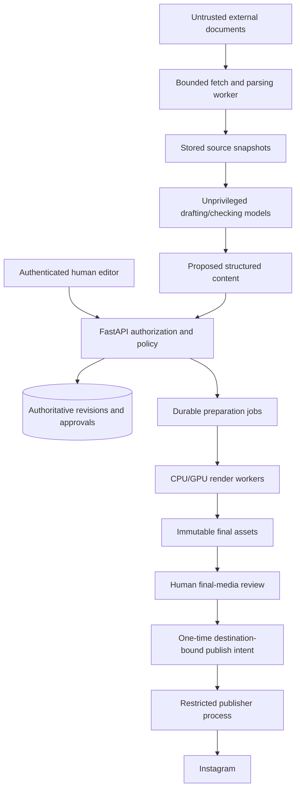
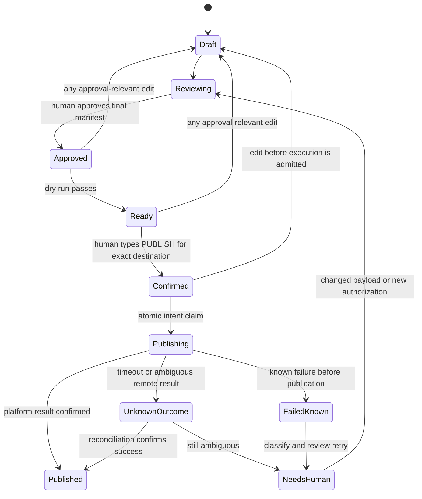

# Giani: advanced implementation plan

**Planning date:** 3 October 2026. **Basis:** the supplied Giani README dated 2 October 2026. **State:** Phase 0 implemented on 3 October 2026; Phases 1–5 proposed.

The original project is a human-in-the-loop newsroom with the fictional anchor Mira, a React Signal Desk, a FastAPI/SQLite workflow API, a private lip-sync handoff, deterministic FFmpeg assembly, and a separately guarded Instagram Post Studio. Preserve those names and boundaries. This plan was written without access to the source files and the three linked build specifications. The Phase 0 work below was done after inspecting them.

## Implementation status (3 October 2026)

Phase 0's code work is done on branch `feat/phase0-safe-publish`. The operator still has to perform the first real publish. Verification: 113 backend tests (77 existing, 36 new) and 12 frontend tests pass, the TypeScript and production builds are clean, and a local smoke run started the real API and gateway against the existing database.

| Plan item | What was built | Where |
|---|---|---|
| §8 remote-outcome layer, state machine | `submitted` is recorded before `media_publish`. Timeouts, dropped connections, 5xx answers, a missing media id, or a restart after submission become `unknown_outcome`, which keeps the revision's slot and locks the post | `instagram.py`, `post_pipeline.py`, `database.py` |
| §8 operator reconciliation | `POST /api/posts/{id}/publications/{pub}/reconcile` with `check` (container status: `PUBLISHED` vs `FINISHED`/`ERROR`/`EXPIRED`, after a settle window), `confirm_published` (verified media id) and `confirm_not_published` (typed `NOT PUBLISHED`). It never publishes. The desk has a matching panel | `post_pipeline.py`, `main.py`, `PostStudioPage.tsx` |
| §1/§8 PUBLISH bound to the destination | The publish request must echo the dry run's `destination_account_id` | `schemas.py`, `main.py` |
| §8 uniqueness key and payload record | Each attempt stores `manifest_sha256` over account, post, revision, format, caption, alt text and slide hashes. The existing partial unique index still allows one non-failed attempt per revision | `post_pipeline.py`, `database.py` |
| §2 ingress concern, Phase 0 media-only delivery | `newsroom_api.media_gateway` serves only `/api/public/media/*`, with no docs or OpenAPI. A Python app was used instead of a Caddy proxy because Caddy is not installed locally | `media_gateway.py`, `public_media.py` |
| §8 "restrict public delivery to reviewed assets" | Media is served only for non-placeholder assets of the current revision of an approved, publishing or published post | `public_media.py` |
| §8 dry run detects expired URLs and wrong MIME | Each slide is fetched through the public address and checked for status, content type, file signature and size. A made-up token must return 404, and API routes reachable without authentication block the publish | `delivery.py` |
| Phase 0 "verify token/permission/account state" | Read-only status checked against the real account. Graph default moved to `v25.0` after checking reads on v21.0 and v25.0. Malformed `NEWSROOM_PUBLIC_BASE_URL` values are now reported as not ready | `config.py`, `media_host.py` |
| Found during implementation | The daily cap compared UTC timestamps with the IST date at 00:00Z, so it counted nothing from 00:00 to 05:30 IST. It now counts from IST midnight | `main.py` |

Not done in Phase 0: the first real publish (operator action), authenticated management routes outside Caddy (the desk itself is still meant for localhost only), and a written backup/restore rehearsal.

## 1. Recommended product direction

Make Giani an **evidence-first production system**: each statement has traceable support, each output has a known content revision, and each external action has an identifiable human authorization.

The three strongest differentiators to build are:

1. **Claim-linked media:** clicking a caption, number, slide or spoken segment reveals the exact reviewed claim and its evidence.
2. **Correction-aware production:** a changed source reveals which drafts, assets and published outputs are affected, and prepares a controlled correction workflow.
3. **A reusable story compiler:** one reviewed evidence packet prepares multiple formats without allowing inconsistent facts, unreviewed translations or silent media changes.

These are proposed product differentiators, not claims of academic novelty or that no other system offers them. A research claim would require a separate literature review and evaluation.

### Keep the current contracts

| Existing contract from the baseline | Upgrade policy |
|---|---|
| Human selects stories and supplies an editorial angle | Preserve; ranking is advisory |
| Daily briefing contains exactly three stories | Preserve the existing profile |
| Weekly deep dive contains one story | Preserve the existing profile |
| Daily scripts: 210–225 words; deep dives: 900–1100 | Preserve the English baseline; new languages need separately reviewed profiles |
| Five hashtags, four overlays, 8–12-second B-roll cadence | Preserve where currently enforced; do not silently change validators |
| Eleven Post Studio checks | Inspect and retain their actual code/IDs; the README does not enumerate them |
| Content edits revoke approval | Extend to translations, crop, source dependencies, voice and template revisions |
| News-video upload is manual | Preserve; a new adapter must not implicitly bypass this |
| Post Studio requires typed PUBLISH confirmation | Preserve and bind it to the exact destination and final revision |
| Demo content is visibly fictional; placeholders cannot publish | Preserve; production source failure should stop live-news preparation rather than insert demo news |
| Research refresh is scheduled at 06:30 Asia/Kolkata | Preserve; preparation only, not approval or publication |

**Do not begin with:** a new frontend framework, ten autonomous agents, Kubernetes, a separate graph database, automatic cross-platform posting, or a new video foundation model. First establish one real, reviewed, recoverable publish path.

## 2. Current baseline and important unknowns

The baseline reports 77 backend and 11 frontend tests passing, a clean TypeScript build, a connected Creator account, publishing disabled, no image-provider key, a missing public-media URL, and deployment not started. These are reported facts from the uploaded README, not live checks performed here.

The following have **not** been established from the attachment: current code quality, exact gate implementation, application authentication outside the documented Caddy deployment, account-wide format permissions, remote duplicate-publish recovery, full model/checkpoint licenses, real video quality, measured operating costs, and backup restorability.

There is a particular ingress concern: the historical local runbook tunnels directly to the whole API. The supplied README documents Caddy protection for production, but it does not establish equivalent protection for that local tunnel. Prefer a media-only local proxy or authenticated ingress. This is a risk to verify, not a claim that a running deployment was exploited. *(Addressed in Phase 0: the runbook now tunnels the media gateway, and the delivery preflight blocks a public address that serves API routes without authentication.)*

## 3. Minimal target stack and ownership

| Layer | Retain / add | Clear responsibility |
|---|---|---|
| Editor interface | Retain React, TypeScript and Vite | Review evidence, revisions, media and intended account |
| Application authority | Retain FastAPI | Validate commands, authorize users and enforce state transitions |
| Local persistence | Retain SQLite initially | Single-editor baseline and local development |
| Multi-worker persistence | Proposed PostgreSQL migration | Transactions, concurrent writers, durable job/attempt records |
| Retrieval | Exact IDs + full-text first; optional pgvector | Find evidence; never decide that it is true |
| Preparation workers | Proposed bounded Python worker process | Fetch, draft, generate and render; no social credentials |
| GPU worker | Retain isolated/private handoff; add capability reporting | Voice/lip-sync jobs with explicit hardware admission |
| Media storage | Retain local assets or R2/S3-compatible adapter | Immutable asset revisions and scoped delivery |
| Scheduling | Retain n8n | Enqueue refreshes and send internal readiness alerts |
| LLM orchestration | Existing adapters; optional LangGraph subworkflow | Bounded draft/check tasks; not publishing authority |
| Typography and cards | Proposed controlled HTML/SVG renderer | Deterministic text, tables, charts and branding |
| Final video assembly | Retain Python/FFmpeg engine | Assemble validated audio, video, captions and overlays |
| Observability | Proposed OpenTelemetry integration | Redacted traces and measured run outcomes |

Use a modular monolith plus workers. Do not introduce PostgreSQL, Redis, Temporal and Celery together merely to appear more advanced. Select one authoritative job/attempt design. PostgreSQL and pgvector are a possible consolidation path, not prerequisites for the first image post. [E15]

LangGraph can persist agent workflow state and pause for review. Keep its state separate from authoritative approval/publish records, and revalidate application permissions whenever a graph resumes. Pre-interrupt operations may run again, so an interrupt is not an exactly-once side-effect guarantee. [E10], [E11]

### Trust boundaries



Only the publisher receives social credentials. A generation worker may write an asset result, but it cannot approve it, edit a publish intent or change the destination account. Source content cannot introduce new tools, recipients, model IDs or external endpoints.

## 4. Module A — source intake and release/event memory

### Scope

Extend the existing research refresh path rather than replacing it. Begin with editor-maintained official feeds, vendor announcement pages, GitHub releases, model cards, research-paper metadata and the current RSS/Hacker News sources. A discovery result is a candidate, not confirmation.

### Suggested components — new files, not existing ones

```text
apps/api/src/newsroom_api/research_intake.py
apps/api/src/newsroom_api/source_snapshots.py
apps/api/src/newsroom_api/event_registry.py
apps/api/src/newsroom_api/story_clusters.py
```

Use the repository's existing data-access style once inspected; these names are proposals. Parsing libraries should be pinned and sandboxed. Docling is an optional document-processing component; inspect its output on the project's actual documents rather than assuming all tables/figures are extracted correctly. [E17]

### Proposed source fields

| Field | Meaning |
|---|---|
| `canonical_url`, `publisher`, `publisher_group` | Identity and possible common ownership/origin |
| `source_role` | First-party announcement, research paper, independent reporting, commentary, or third-party artifact |
| `published_at`, `event_at`, `first_seen_at`, `fetched_at` | Different clocks; never replace one with another |
| `timezone`, `date_precision` | Preserve source timezone and whether time/date is unknown or approximate |
| `raw_sha256`, `normalized_sha256`, `parser_version` | Versioned material and the extraction that produced it |
| `excerpt`, `locator`, `language` | Human-inspectable supporting content |
| `rights_status`, `retention_policy` | Whether and how content may be stored or displayed |
| `derived_from_source_id` | Syndication/copying relationship when established |
| `fetch_status`, `verification_status` | Separate network success from editorial validation |

Do not retain full copyrighted articles automatically. Keep permitted metadata/excerpts, and use full snapshots only where allowed. Do not bypass paywalls, authentication or publisher access controls. Failed retrieval must remain visible.

### Release-event categories

Use separate events for `paper_published`, `announced`, `preview_opened`, `api_available`, `weights_released`, `quantization_published`, `updated` and `retired`. These are not one mutually exclusive model status: a model can have several events at different times.

A new GGUF upload of an old checkpoint should not automatically become a new base-model launch. A current article discussing an old release should not reset the release date. A first-party benchmark supports an attributed performance claim, not independent superiority.

### Retrieval and deduplication

Start with normalized URLs, exact model/repository identifiers, title similarity and content hashes. Group likely duplicates but preserve distinct announcements. Maintain a common-origin flag so ten syndicated articles do not become ten independent sources.

Add embedding retrieval only against an editor-labeled relevance set. Compare lexical-only and hybrid retrieval on exact model names, release dates and ambiguous acronyms. All approximate matches need exact-source confirmation before becoming evidence.

### Acceptance tests

An old model in a new article is not classified as a new release. A paper with weights arriving later retains both dates. Unknown timezones are flagged rather than converted arbitrarily. Redirects cannot fetch localhost, private network ranges or cloud metadata services; validate each redirect and DNS resolution, restrict protocols, and enforce byte/time limits.

## 5. Module B — Claim Ledger and Evidence Desk

### Claim contracts

Split drafts into atomic factual assertions where practical. A claim should retain its source-dependent qualifications, units, population/task scope and exact named entities. Avoid splitting away a qualification that changes the meaning.

| Proposed object | Core data |
|---|---|
| Claim | ID, statement, type, subject, metric/value/unit when relevant, attribution, valid time |
| Evidence edge | Claim ID, snapshot ID, exact locator, support/contradiction relation, source independence |
| Review | Reviewer identity, decision, note, policy version, timestamp and exact claim/snapshot hashes |
| Use | Story revision, paragraph/slide/segment ID, displayed or spoken representation |

Use `supported`, `partially_supported`, `contradicted`, `unverified` and `superseded` as editorial states. Do not show “97% true” based on an uncalibrated model score. Keep model suggestions visibly separate from human decisions.

### Proposed checks

Check exact numbers and units against evidence; reject unsupported “best,” “first,” “open-source,” “free,” “available now” and hardware claims unless the statement is suitably supported and qualified. Check quoted text against the permitted excerpt. Verify whether a result is reported by its authors, independently reproduced, or merely mentioned elsewhere.

A single first-party source can support its own announcement. Independent corroboration becomes more important for disputed assertions, benchmark comparisons or broader claims. Do not require two arbitrary sources for every trivial statement or accept two copies of the same press release as independent evidence.

### Editorial interface

Add an Evidence tab beside the script. Selecting a sentence should reveal supporting excerpts, dates, source role and unresolved contradictions. Show blocking issues separately from optional suggestions. The reviewer can narrow a statement, remove it, request more evidence or explicitly attribute it; an assistant does not self-approve.

### Suggested evaluation

Build 30 editor-curated story packets, with 10 used to debug and 20 frozen for evaluation. Include dates, comparable and incomparable benchmarks, API versus weights availability, model licenses, product announcements, uncertain claims and conflicting reports. Annotate claims and allowed evidence manually.

Measure unsupported-claim rate, exact-value preservation, source-locator validity, contradiction recall, false blocking and time to review. “Every claim has a link” is a coverage metric, not proof that the linked source supports the claim.

### Acceptance gate

On the frozen pack, there must be zero accepted seeded critical errors such as a fabricated launch date or a changed unit. Report denominators and uncertainty. Passing a finite pack does not establish zero hallucinations in the real world. Missing human approval always remains a deterministic blocker.

## 6. Module C — StorySpec, templates and incremental rendering

### Proposed StorySpec

A StorySpec is an intermediate content representation, not a prompt with every detail mixed together. It holds reviewed claim IDs, editorial angle, profile, ordered sections, approved copy, source notes, brand/identity versions, media roles, accessibility text and target renditions.

The `examples/storyspec.synthetic.json` fixture described with this plan was not included and is not in the repository. Any such fixture must be visibly fictional, not a validated schema implementation or publishable news. Convert the design to Pydantic/JSON Schema only after inspecting current models.

### Template-first output

Create three initial templates: headline card, comparison card and explainer carousel. The template owns text layout, source attribution, disclosure, safe areas and chart labels. Validate length/overflow from real rendered dimensions. Keep source values in structured data and render numeric labels from that data.

Use generative imagery only where it adds editorial value. Mark conceptual images as illustrations. Do not generate a purported event photo or screenshot and present it as evidence. Uploaded photos also need rights and context review; upload alone is not a factuality guarantee.

A template render can be a legitimate non-placeholder asset without an image-generation API. Implement it as a new provider with an explicit asset origin such as `deterministic_template`, not by removing the existing placeholder stamp or bypassing the placeholder gate.

### Multi-format preparation

Prepare square/portrait images, carousels and the existing video profiles from one evidence packet. Newsletter or website exports can follow later. New channels initially export review packages only. An Instagram Story/Reel option in a UI is not proof that its current login route/account can publish it.

Every rendition has its own revision, crop, text, alt text and approval. Shortening a headline can remove a qualification, so a derivative is not automatically factually equivalent. English approval does not approve a Hindi or Punjabi translation.

### Build dependency graph

```text
reviewed claim ─┬─> English copy ──> narration chunk ──> lip-sync segment
               ├─> chart data ────> chart layer
               ├─> carousel copy → template slide
               └─> translation ──> language narration/subtitles

all output assets → final rendition manifest → final human approval
```

Use stable section IDs. Cache keys should include the relevant input content hashes, adapter/model revision, generation settings, identity/voice version, template version and necessary rendering dependencies. Record font identifiers/checksums internally; do not distribute font files without the appropriate rights.

A source/evidence update can invalidate approval without changing a media asset's bytes. A corrected sentence normally invalidates its narration and caption dependencies; a logo change invalidates affected frames, not unrelated speech. Do not re-render the whole episode when only one dependency changed.

Pin the render environment and preserve output hashes. Do not promise byte-for-byte reproducibility for every GPU/codec/model combination. For nondeterministic generation, retain the exact reviewed artifact; regeneration creates a new revision even when the same prompt was used.

### Acceptance tests

One numeric change propagates to every intended derivative. An unchanged audio chunk is reused rather than billed/generated twice. An old generated slide cannot satisfy a new revision's gate. No template overflows the tested safe area. A synthetic illustration cannot masquerade as a documentary asset.

## 7. Module D — voice, language and video QA

### Keep a baseline and test bounded challengers

Retain the existing ElevenLabs option and faster-whisper caption path. Introduce one hosted and one local voice challenger initially, rather than connecting every model at once. Test the same approved scripts, normalized audio formats and target loudness across candidates. [E20]

| Candidate | Proposed experiment | Important boundary |
|---|---|---|
| Gemini 3.8 Flash / Flash-Lite TTS | Hosted narration challenger; current release notes record 22 September 2026 availability | Check account access, current supported voices/languages and actual pricing before use [E03] |
| AuK / AuK-Flash | Generate or repair a selected sentence while preserving an approved original voice profile | September releases/deployment changes justify a pilot, not an assumed fit on this GPU [E05] |
| Qwen3-TTS 0.6B or 1.7B | Local English voice-design/narration challenger | Listed language support excludes Hindi/Punjabi; do not route these languages here [E06] |
| IndicF5 | Hindi/Punjabi edition pilot | Native-speaker review, reference-audio rights and local hardware profiling required [E07] |

No voice switch is silent. Maintain Mira's fictional identity, approved reference materials, voice provenance, permitted uses and reviewer-approved pronunciation lexicon. Do not clone a real person's voice without authorization or imply endorsement.

### Pronunciation and localization

Create a small pronunciation test set containing AI model names, acronyms, decimal numbers, currencies, dates and mixed-language phrases. Maintain separate display and spoken forms: a spoken expansion must preserve the original value and unit.

A translation must preserve factual scope and hedging. Back-translation can flag issues but cannot replace a fluent reviewer. New language editions need appropriate word/timing policies; do not blindly apply English word-count assumptions.

Measure word/character error, named-entity and number preservation, repeated/omitted phrases, naturalness, audible artifacts and voice consistency. An ASR comparison is a triage signal and can itself be wrong; important names/numbers need listening review. Review every final mixed/normalized audio artifact.

### Lip-sync and render admission

The official LatentSync repository lists 18 GB minimum for 1.6 and 8 GB for 1.5. Keep the baseline's rejection of 1.6 on a single 16 GB T4. Two separate 16 GB cards do not automatically satisfy a single-device 18 GB requirement. MuseTalk remains an existing fallback to test, not a guaranteed quality/speed result on the user's hardware. [E08], [E09]

A worker must report GPU model, free memory, framework/checkpoint revisions and a measured smoke-run result. Queue jobs beyond the admitted budget rather than overcommitting. Avoid hosting model inference inside the API request process.

Use short, stable segments only after validating transitions and voice continuity. For unavailable GPU capacity, an editor can approve a still-anchor/card-based presentation mode, clearly distinct from lip-synced video. Do not fabricate a completed GPU result.

### Output QA

Check decode success, actual duration, audio presence, silence/clipping, alignment, readable captions, color/size profile, safe areas, frame discontinuities and final manifest hashes. A vision-language model can flag suspicious frames but cannot certify media quality or factual truth. Keep the human final review.

## 8. Module E — reliable publishing and recovery

### Why the existing revision guard needs a remote-outcome layer

The baseline describes a database-backed guard against duplicate publication of the same revision. Extend it to cover application crashes and remote ambiguity. A local database transaction cannot atomically commit a social platform's publication.

A useful proposed uniqueness key is:

```text
SHA256(workspace_id | destination_account_id | post_id |
       approved_revision_id | final_media_manifest_sha256)
```

A key is one part of the design, not proof of exactly-once delivery. Persist platform container IDs, known media IDs, request attempts, approval references and reconciliation outcomes.

### Proposed state machine



Cancellation or revocation after a remote request has been sent cannot guarantee that publication is prevented. Surface the in-flight state, stop further actions and reconcile. Do not promise rollback of a successful external publication.

### Required behavior

Atomically verify expected revision, destination, permissions, approval status and final hashes before claiming the intent. Give intents an expiry. Lock the approved payload against mutation; edits create a new revision rather than replacing files at a URL.

Check current account capability and quota at execution. Account quota values are not timeless constants. Keep staged media accessible throughout the actual platform fetch/processing window, and restrict public delivery to reviewed assets. A dry run should detect authentication challenges, expired URLs and wrong MIME/decode results; it does not prove that a later platform fetch will succeed.

Handle retryable reads separately from unsafe writes. Poll a known container when allowed; do not create another container or repeat a publish automatically after an ambiguous response. Preserve an operator reconciliation path when the platform does not expose sufficient state.

Record only redacted request metadata. Neither raw access tokens nor token-bearing media URLs belong in traces. n8n, an LLM or a GPU callback cannot synthesize human confirmation.

### Tests before enabling the path

Test two simultaneous clicks, a worker crash after container creation, a timeout after remote success, a late callback for an old revision, an expired token, an edited caption after approval, a wrong destination account, revoked permissions and an inaccessible final asset. Repeat after process restart, not just in one in-memory test.

## 9. Module F — provenance, correction workflow and public source notes

Start with a signed or integrity-protected internal rendition manifest that records asset hashes, source/claim revisions, creation tools, reviewer approval and disclosure text. Its signing key must be stored separately from public media, with explicit rotation and verification procedures.

Evaluate C2PA embedding on supported final file formats. C2PA records cryptographically verifiable provenance assertions; it does not certify the story's factual accuracy. A self-signed test credential should not be described as a universally trusted identity. Maintain a source page and sidecar because platform transformations may separate credentials from the uploaded asset. [E12]

Keep private reviewer identifiers and restricted source excerpts out of public provenance. A public source card may contain permitted citations, timestamped corrections and a statement that Mira is fictional/AI-generated. It should not leak raw source documents or voice references.

### Correction example — fictional

A reviewed story says a model needs 16 GB memory. Its author later corrects the requirement to 24 GB. Giani should show the evidence diff, identify the affected claim, caption and narrated segment, suspend any unsent approvals, and prepare revised outputs. The editor decides how to correct already published material. No silent historical overwrite is allowed.

Measure correction-impact recall on seeded dependencies. Track both missed derivatives and unnecessary invalidations. A useful target is complete detection of the explicitly seeded dependencies in the test pack; this is not a claim of complete real-world error detection.

## 10. Module G — operations, security and spending

### Durable jobs and state

Use persistent records with job ID, stage, input hash, attempt number, lease owner, lease expiry, heartbeat and result manifest. Completion should be conditional on the current lease and expected revision. Reject duplicate or stale completions. Recovery must distinguish transient operational failures from content-validation failures.

Use a transactional outbox to connect authoritative revision changes to work scheduling. Consumers must be idempotent. If using SQLite initially, keep the writer model constrained and test its locking behavior; move to PostgreSQL before claiming scalable concurrent writes.

### Security requirements

Treat fetched HTML, Markdown, PDFs, image metadata and model outputs as untrusted data. Limit tools and network destinations structurally; input filters and prompt instructions alone are insufficient. Use least privilege, output validation and human gates. OWASP documents the indirect-injection and tool-abuse problem and layered defenses. [E16]

Enforce application authorization in addition to ingress authentication. Add role checks for reviewer, publisher and administrator only when a multi-user model is introduced; no such RBAC implementation is established by the current README. Use CSRF protection where cookie authentication applies, restricted CORS, authenticated event streams, size limits, safe file paths and media decoding in a bounded worker.

Do not execute downloaded model-card code, shell snippets or document macros. Review and pin any model requiring remote custom code. Restrict webhook callbacks to signed, fresh, expected job results; rate-limit public media delivery and keep it separate from API administration.

### Storage and backups

Keep original assets immutable. Separate private sources/reference media from public final renditions. Validate restore of the database, asset manifests, allowed source snapshots and relevant configuration. Preserve the n8n encryption key with the appropriate secret backup procedure once its actual configuration is inspected.

For object storage, test delivery from the actual public HTTPS path. Do not use a public bucket for all workspace data. Cloudflare documents custom-domain and public-bucket options; choose an appropriately scoped delivery design rather than treating R2 as automatically private once a public URL is enabled. [E19]

### Observability and budget

Record stage spans with correlation IDs, durations, retry counts, provider/model versions and redacted validation outcomes. OpenTelemetry is a suitable instrumentation layer. Add custom usage/cost records from actual provider responses rather than assuming the trace library computes them. [E14]

Track:

```text
cost per accepted story = total attributable provider + worker costs / accepted stories
editor minutes per accepted story
unsupported claims accepted / audited factual claims
render cache-hit rate
known failures versus unresolved remote outcomes
correction completion time, with sample size
```

Include failed generations and regenerations in cost. Separate allocated monthly hosting cost from marginal provider charges. Configure a per-story and per-workspace cap, and stop at the cap rather than switching to another provider silently. A proposed initial retry policy is at most two automatic retries for explicitly safe preparation operations; publication retries require their own state-aware policy.

Preserve free/demo and modest single-editor deployment options. No dollar/rupee operating-cost promise is made because neither measured throughput nor provider account pricing was supplied.

## 11. Proposed data model and endpoints

### Logical tables — inspect existing schema before migrations

| Logical entity | Relationship / invariant |
|---|---|
| `source_documents`, `source_snapshots` | One source identity, many immutable fetch snapshots |
| `story_events`, `story_clusters` | Model/product events can share a story cluster without conflating dates |
| `claims`, `claim_revisions`, `evidence_edges` | Claims retain reviewable versioned support/contradiction |
| `story_revisions`, `renditions` | A story may have multiple independently reviewed format/language outputs |
| `asset_revisions`, `asset_dependencies` | Immutable media and explicit upstream dependency hashes |
| `approvals` | Identity, exact revision/manifest, policy, destination where relevant, expiry/revocation |
| `publish_intents`, `publish_attempts` | Guarded external side effects with durable reconciliation |
| `jobs`, `outbox_events` | Persisted preparation and delivery state |
| `provider_runs`, `model_registry` | Exact model capability/admission, actual usage and execution provenance |
| `corrections` | Old/new claim revisions, impacted artifacts and approved corrective actions |

No field should be marked required merely because an LLM can invent a plausible value. Unknown hardware, license scope, source date or account capability should remain null/blocked.

### Existing routes described in the README

`POST /api/research/refresh`, `GET /api/capabilities`, `GET /api/instagram/status`, the token-maintenance routes, and `/api/public/media/*` are source-reported. Their actual request/response schemas must be inspected; they were not provided.

### Proposed routes — not implemented

| Route | Purpose |
|---|---|
| `GET /api/stories/{id}/claims` | Evidence Desk data |
| `GET /api/sources/{id}/diff` | Source snapshot comparison |
| `POST /api/claims/{id}/review` | Authenticated reviewer decision with expected revision |
| `POST /api/stories/{id}/prepare-renditions` | Enqueue bounded, non-publishing preparation |
| `GET /api/renditions/{id}/dependencies` | Explain asset/claim lineage |
| `GET /api/runs/{id}/events` | Authenticated run progress stream |
| `POST /api/posts/{id}/publish-intents` | Create a destination-bound intent after existing gates |
| `POST /api/publish-intents/{id}/confirm` | Consume exact human confirmation; no LLM access |
| `POST /api/publish-attempts/{id}/reconcile` | Operator-controlled recovery for uncertain outcomes |
| `POST /api/corrections` | Create a correction review workflow, not automatic external edits |

Use explicit expected revisions and meaningful conflict responses. Never infer the target post or account from “the latest item.” Integrate with current Post Studio routes rather than exposing two competing publish implementations.

## 12. Six implementation phases

These phases are engineering work packages, not calendar commitments. Each has a stop condition; no phase is implemented by this document.

### Phase 0 — honest baseline and safe delivery

Inspect actual models, gates, migrations, authentication and existing tests. Run the reported 77/11 suite, TypeScript build and capability/status checks in the developer's environment. Capture results rather than assuming the historic counts remain correct. Configure media-only delivery and verify token/permission/account state. Publish one owned reviewed image only through the existing confirmation path.

**Exit:** known deployment configuration, authenticated/private management routes, valid media delivery, real platform result and a documented rollback/reconciliation procedure. Stop on any unknown public API exposure or unresolved publish outcome.

### Phase 1 — evidence and event intelligence

Implement bounded intake, source snapshots, date/event types, initial clustering and Claim Ledger. Add the Evidence Desk. Use no model fine-tuning and no vector database initially. Add factual/temporal test fixtures.

**Exit:** every factual statement in the pilot packets has inspectable evidence; seeded date/unit/attribution errors are blocked or surfaced; human source review remains authoritative.

### Phase 2 — template-first StorySpec and corrections

Implement the three templates, validated StorySpec, rendition manifests and dependency tracking. Add exact number rendering, source cards and correction impact previews. Reuse reviewed assets rather than regenerating them.

**Exit:** real non-placeholder template output passes the existing checks; an edited number invalidates all affected approvals; unrelated assets are reused; each format has distinct final review.

### Phase 3 — bounded speech and media upgrades

Add one hosted and one local voice candidate after rights/hardware checks. Add pronunciation QA and an optional Hindi/Punjabi pilot through an eligible provider. Keep the existing lip-sync choices unless a measured defect justifies a change. Implement actual-audio timing and final render QA.

**Exit:** candidate outputs pass the same listening/visual review as the baseline, with recorded cost, memory and failure rates. No universal speed, quality or language-support claim is made.

### Phase 4 — durable operations and controlled scale

Implement persisted attempts, transactional outbox, lease-based jobs, stale-result rejection and unknown-outcome reconciliation. Move to PostgreSQL if adding concurrent workers/editors. Add tracing, usage caps, restore tests and model/API lifecycle checks. Keep n8n preparation-only.

**Exit:** interruption/crash tests recover without double publication, secrets stay out of traces, backups restore, and multiple clients cannot approve/publish the wrong revision.

### Phase 5 — evaluation, provenance and release decision

Freeze the evaluation pack. Run paired comparisons against the original workflow on the same stories and hardware/profile. Add C2PA proof-of-concept and public source/correction notes after privacy review. Run shadow operation, then review-only real preparation, then limited manually confirmed Post Studio use.

**Exit:** publish a measured report with sample sizes, errors and limitations; no known critical seeded approval/privacy/factuality failures; operator sign-off. Multi-workspace use and other platform adapters remain separate projects with their own permission and quality gates.

## 13. Bounded experiment plan

| Experiment | Arms | Keep fixed | Decide using |
|---|---|---|---|
| Evidence workflow | Existing source review vs Claim Ledger | Same 20 frozen story packets | Critical errors, missed contradictions, false blocks, editor time |
| Visual production | Existing selected image path vs templates + optional illustration | Same approved copy and output sizes | Text/data correctness, edit time, accepted output cost |
| Narration | Existing voice path vs one hosted and one local candidate | Same 30 approved utterances plus 2 complete scripts | Names/numbers, naturalness, continuity, cost and peak memory |
| Recovery | Normal completion vs seeded crashes/timeouts | Same immutable approved revision | Correct final state, duplicate external effects and operator work |
| Correction propagation | Known seeded dependency changes | Frozen dependency graph fixtures | Affected-asset recall and unnecessary rebuilds |

These are proposed evaluation sizes. A useful product target could be reducing median editor time by 25–30% without worsening factual errors, but no such gain has been measured. Do not promote a model for being newer or a workflow for being more autonomous.

## 14. Coding-agent handoff

Before editing, read the real `posts.py`, `imaging.py`, `post_pipeline.py`, `media_host.py`, `instagram.py`, data models, tests and infrastructure configuration. Preserve the current safe defaults and all existing behavior unless an explicit migration changes it.

Implement one phase in a branch with a database/rollback plan, unit tests and offline integration fixtures. Do not add fake success results, modify historic test reports, hard-code account quotas, turn demo outputs into real assets, expose publisher tools to models, or enable Instagram publishing. Document new configuration separately until the parser actually supports it.

A commit that only adds these documentation files should be described as **documentation and implementation planning**, not Giani v2 deployed. A feature becomes implemented only after code, tests and a reproducible verification record exist.

## External references

Reference keys match the companion source audit. They establish upstream capabilities or technical guidance, not implementation in this repository.

[E01]: https://developers.openai.com/api/docs/changelog "OpenAI API changelog"
[E02]: https://developers.openai.com/api/docs/guides/image-generation "OpenAI image-generation guide"
[E03]: https://ai.google.dev/gemini-api/docs/changelog "Gemini API release notes"
[E04]: https://ai.google.dev/gemini-api/docs/image-generation "Gemini image-generation guide"
[E05]: https://github.com/Tencent-Hunyuan/AuK "Tencent Hunyuan AuK repository"
[E06]: https://github.com/QwenLM/Qwen3-TTS "Qwen3-TTS repository"
[E07]: https://huggingface.co/ai4bharat/IndicF5 "AI4Bharat IndicF5 model card"
[E08]: https://github.com/bytedance/LatentSync "LatentSync official repository"
[E09]: https://github.com/TMElyralab/MuseTalk "MuseTalk official repository"
[E10]: https://docs.langchain.com/oss/python/langgraph/persistence "LangGraph persistence"
[E11]: https://docs.langchain.com/oss/python/langgraph/interrupts "LangGraph interrupts"
[E12]: https://spec.c2pa.org/specifications/specifications/2.3/specs/C2PA_Specification.html "C2PA specification 2.3, explicitly versioned reference"
[E13]: https://www.remotion.dev/docs/license/pricing "Remotion license and pricing"
[E14]: https://opentelemetry.io/docs/languages/python/ "OpenTelemetry Python documentation"
[E15]: https://github.com/pgvector/pgvector "pgvector official repository"
[E16]: https://cheatsheetseries.owasp.org/cheatsheets/LLM_Prompt_Injection_Prevention_Cheat_Sheet.html "OWASP prompt-injection prevention"
[E17]: https://docling-project.github.io/docling/ "Docling documentation"
[E18]: https://caddyserver.com/docs/caddyfile/directives/handle "Caddy handle directive"
[E19]: https://developers.cloudflare.com/r2/buckets/public-buckets/ "Cloudflare R2 public-bucket guidance"
[E20]: https://github.com/SYSTRAN/faster-whisper "faster-whisper official repository"
